# Minimalist portfolio Template

You can use my [emailer server](https://github.com/royeradames/email-server.git) for getting the form data to your email.

## Table of contents

- [Minimalist portfolio Template](#minimalist-portfolio-template)
  - [Table of contents](#table-of-contents)
  - [Overview](#overview)
    - [The challenge](#the-challenge)
    - [Screenshot](#screenshot)
      - [Home Page](#home-page)
        - [Home Mobile](#home-mobile)
        - [Home Tablet](#home-tablet)
        - [Home Desktop](#home-desktop)
      - [Portfolio Page](#portfolio-page)
        - [Portfolio Mobile](#portfolio-mobile)
        - [Portfolio Tablet](#portfolio-tablet)
        - [Portfolio Desktop](#portfolio-desktop)
      - [A specific project Template Page](#a-specific-project-template-page)
        - [Mobile Project Template Page](#mobile-project-template-page)
        - [Tablet Project Template Page](#tablet-project-template-page)
        - [Desktop Project Template Page](#desktop-project-template-page)
      - [Contact-me Page](#contact-me-page)
        - [Mobile Contact-me Page](#mobile-contact-me-page)
        - [Tablet Contact-me Page](#tablet-contact-me-page)
        - [Desktop Contact-me Page](#desktop-contact-me-page)
      - [Mobile Menu](#mobile-menu)
      - [Contact-me Form Error](#contact-me-form-error)
    - [Links](#links)
  - [My process](#my-process)
    - [Built with](#built-with)
    - [What I learned](#what-i-learned)
      - [show the images depending on the sizes, and the px density](#show-the-images-depending-on-the-sizes-and-the-px-density)
      - [Open React Router <Link> At The Top Of Page With JavaScript](#open-react-router-link-at-the-top-of-page-with-javascript)
      - [Cleaning Importing SVGs In React](#cleaning-importing-svgs-in-react)
      - [Using CSS grid to handle white space instead of margin](#using-css-grid-to-handle-white-space-instead-of-margin)
    - [Useful resources](#useful-resources)
  - [Author](#author)

## Overview

### The challenge

Users should be able to:

- View the optimal layout for each page depending on their device's screen size
- See hover states for all interactive elements throughout the site
- Click the "About Me" call-to-action on the homepage and have the screen scroll down to the next section
- Receive an error message when the contact form is submitted if:
  - The `Name`, `Email Address` or `Message` fields are empty should show that the field is required.
  - The `Email Address` is not formatted correctly should show "Please use a valid email address"

### Screenshot

#### Home Page
##### Home Mobile
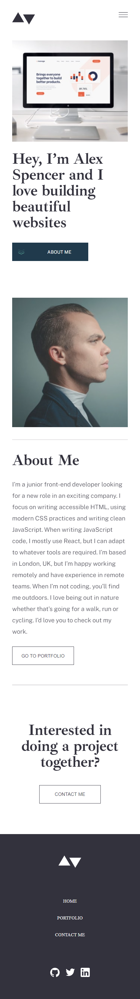
##### Home Tablet
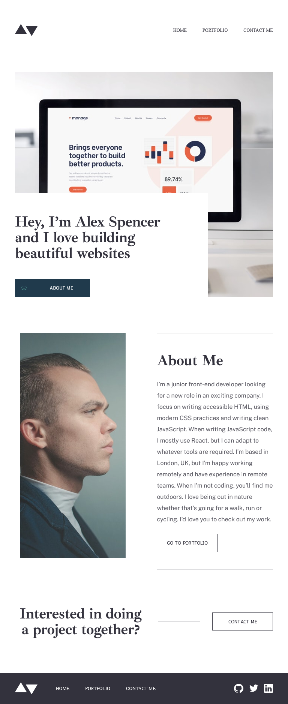
##### Home Desktop
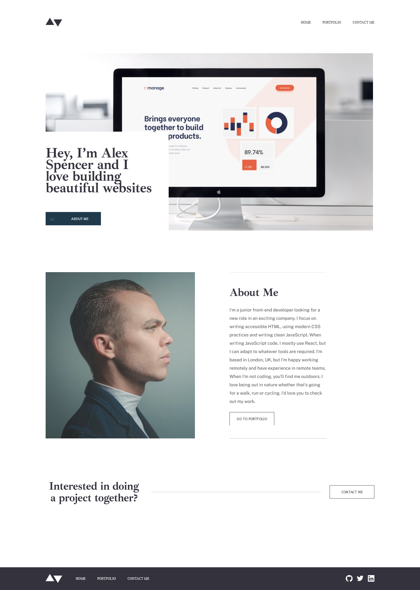
#### Portfolio Page
##### Portfolio Mobile
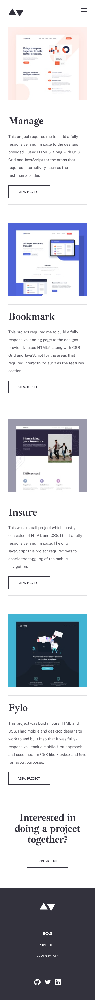
##### Portfolio Tablet
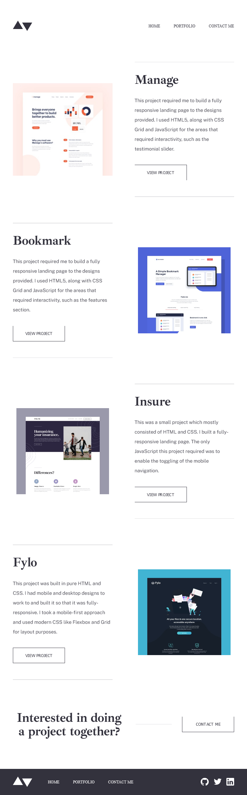
##### Portfolio Desktop

#### A specific project Template Page

##### Mobile Project Template Page
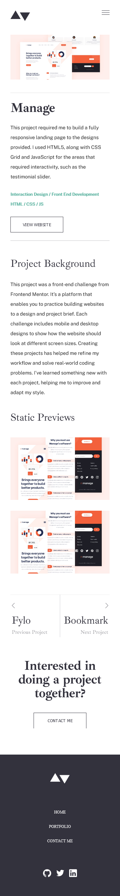
##### Tablet Project Template Page
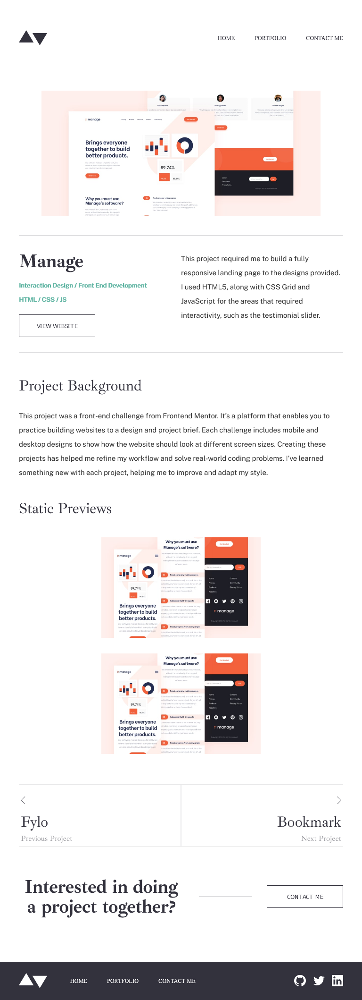
##### Desktop Project Template Page
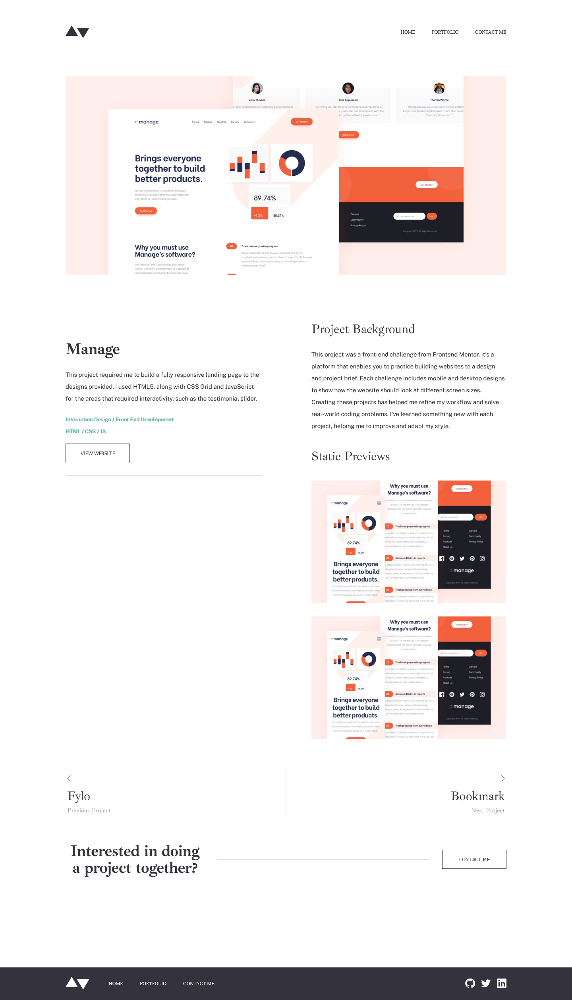
#### Contact-me Page
##### Mobile Contact-me Page

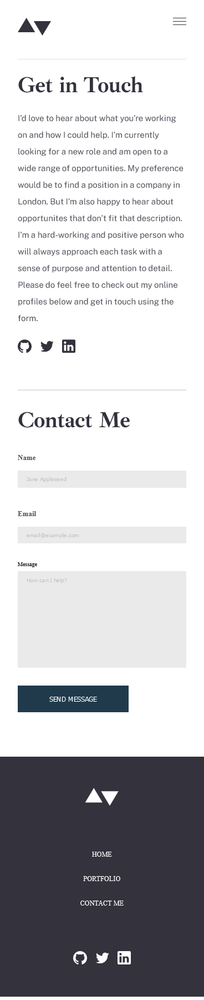
##### Tablet Contact-me Page
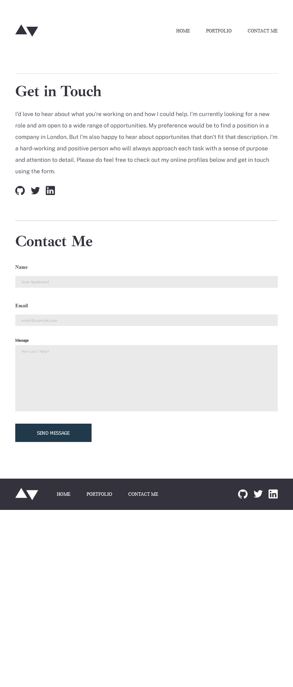
##### Desktop Contact-me Page
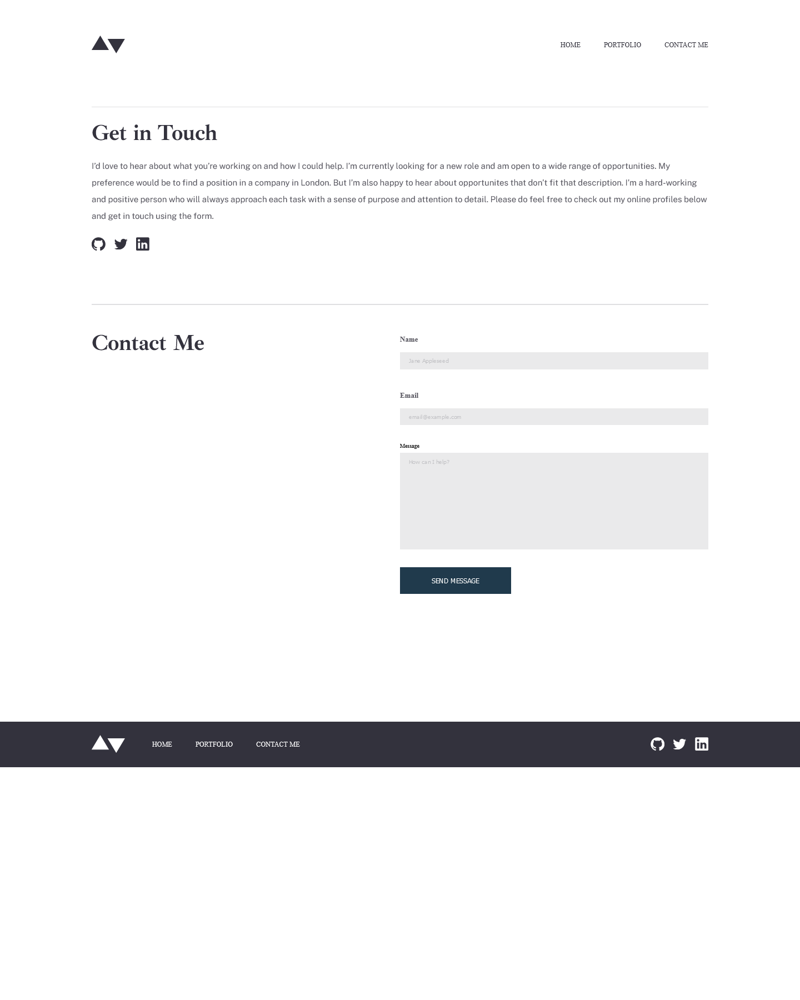

#### Mobile Menu
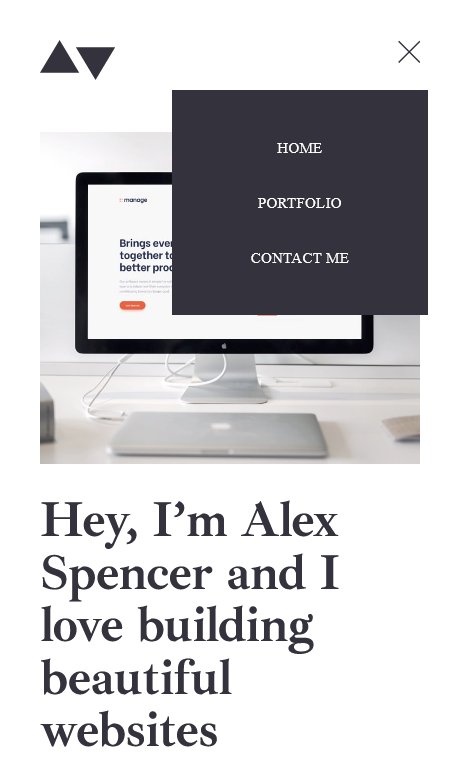
#### Contact-me Form Error
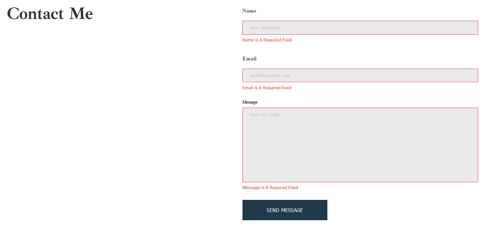


### Links

- Blog URL: [Royer Adames Blog](https://medium.com/@royeraadames)
- Live Site URL: [Royer Adames Minimalist Portfolio](https://royer-adames-minimalist-portfolio.vercel.app/)

## My process

### Built with

- Semantic HTML5 markup
- CSS custom properties
- CSS Grid
- Mobile-first workflow
- [React](https://reactjs.org/) - JS library
- [Sass](sass-lang.com/) - For styles

### What I learned

Use this section to recap over some of your major learnings while working through this project. Writing these out and providing code samples of areas you want to highlight is a great way to reinforce your own knowledge.

To see how you can add code snippets, see below:
#### show the images depending on the sizes, and the px density
```js
<picture className="portfolio__img">
  <source
    srcSet={`${project.imgLinkDesktop} 1x, ${project.imgLinkDesktop2x} 2x`}
    media={mediaQueries.desktop}
  />
  <source
    srcSet={`${project.imgLinkTablet} 1x, ${project.imgLinkTablet2x} 2x`}
    media={mediaQueries.tablet}
  />
  <source
    srcSet={`${project.imgLinkMobile} 1x, ${project.imgLinkMobile2x}`}
  />
  
</picture>

}
```
#### Open React Router <Link> At The Top Of Page With JavaScript
```js
/* Link to previous and next projects on the project list */
<Link
  to={`/projects/${previousProjectDetail.id}/${previousProjectDetail.title}`}
  className="other-project__previous-project-link"
  onClick={() => {
    window.scroll(0, 0);
  }}
>
</Link>
}
```
#### Cleaning Importing SVGs In React
```js
// import SVGs
import { ReactComponent as LeftArrow } from "../images/icons/arrow-left.svg";
import { ReactComponent as RightArrow } from "../images/icons/arrow-right.svg";

// using the SVGs
<LeftArrow className="other-project__button-icon other-project__previous-project-icon" />
<RightArrow className="other-project__button-icon other-project__next-project-icon" />
```
#### Using CSS grid to handle white space instead of margin
```css
grid-template:
  "hero hero" max-content
  ". ." 11.5rem //white space
  "manage background-article" min-content
  "manage ." 4rem //white space
  "manage previews" min-content
  ". previews" max-content
  ". ." 6.4rem // white space
  "others others" 1fr
  ". ." 6.4rem // white space
  "contact-me contact-me" max-content
  ;
```

### Useful resources

- [Responsive images in React: show images depending on windows size, and the px density](https://royeraadames.medium.com/responsive-images-in-react-show-images-depending-on-windows-size-and-the-px-density-ab8e9caa34c5) - Show the images depending on the sizes, and the px density.
- [Importing SVGs In React: The Clean Way](https://royeraadames.medium.com/importing-svgs-in-react-the-clean-way-2d6e65da73cd) - Clean way to import SVGs.
- [Open React Router <Link> At The Top Of Page With JavaScript](https://royeraadames.medium.com/open-react-router-link-at-top-of-page-c8e48a72da99) - Open React Router DOM <Link>s At The Top Of Page With JavaScript so that the user does not feel confuse when navigating the page.
- [Responsive images](https://developer.mozilla.org/en-US/docs/Learn/HTML/Multimedia_and_embedding/Responsive_images) - How to handle responsive images.
- [What Img Srcset Does In HTML5: A Quick & Simple Guide](https://html.com/attributes/img-srcset/) - How to handle responsive images.
- [Style child element when hover on parent](https://stackoverflow.com/questions/7217244/style-child-element-when-hover-on-parent) - How to change the style of children's element when there is hover on the parent element.
- [HTML Horizontal Line](https://www.bitdegree.org/learn/html-horizontal-line) - How to decide between semantic line or visual line.
- [set a className on custom react components](https://stackoverflow.com/a/46040808/3044126) - Passing props to add custom CSS classes to components.
- [Dynamically import images in React](https://www.youtube.com/watch?v=zYE-PbInWNE) - A way to dynamically render images in React.
- [In ReactJS trying to get params but I get property 'id' does not exist on type '{}'](https://stackoverflow.com/a/64082419/3044126) - React TypeScript fix for params type error.

## Author

- Blog - [Medium](https://royeraadames.medium.com/)
- LinkedIn - [royeradames](https://www.linkedin.com/in/royer-adames/)
